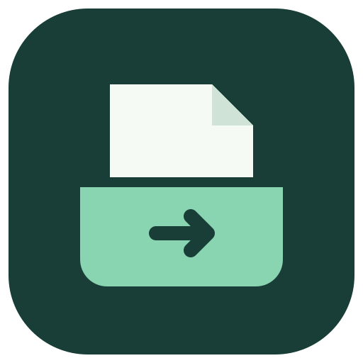

# 滴答清单备份助手

**任务、图片、附件，一起带走。**

将滴答清单 / TickTick 备份成 Markdown，在 Obsidian 或本地继续使用。免费开源，支持 macOS 和 Windows。

[English](README.en.md)

## 为什么用它

官方 CSV 备份不包含图片和文件附件。滴答清单备份助手把任务内容与附件一起保存，让你的备份更完整，也更方便阅读。

- **任务变成笔记**：按清单整理 Markdown，保留正文、任务状态、时间、标签及父子关系。
- **图片与文件一起保存**：图片和 CSV 等文件附件下载到本地，笔记中可直接查看图片、打开附件。
- **备份位置自己选**：选择文件夹和文件名，导出一个 ZIP，解压后就是 Markdown 笔记库。
- **结果清楚可见**：展示任务与附件数量；有内容未成功保存时，会列出原因并提供重试。

在官方页面登录，不修改源任务内容。备份保存到你选择的位置，不上传到本工具的服务器。

## 下载与安装

**[1.0.0 已发布](https://github.com/wrightgeoff112-star/ticktick-to-markdown/releases/tag/v1.0.0)，下载适合你电脑的安装包：**

| 你的电脑 | 选择的安装包 | 安装方式 |
| --- | --- | --- |
| Mac · Apple 芯片 | [下载 Apple Silicon DMG](https://github.com/wrightgeoff112-star/ticktick-to-markdown/releases/download/v1.0.0/ticktick-backup-assistant-1.0.0-macos-arm64.dmg) | 打开后拖入「应用程序」 |
| Mac · Intel 芯片 | [下载 Intel DMG](https://github.com/wrightgeoff112-star/ticktick-to-markdown/releases/download/v1.0.0/ticktick-backup-assistant-1.0.0-macos-x64.dmg) | 打开后拖入「应用程序」 |
| Windows · 64 位 Intel / AMD | [下载 Windows EXE](https://github.com/wrightgeoff112-star/ticktick-to-markdown/releases/download/v1.0.0/ticktick-backup-assistant-1.0.0-windows-x64.exe) | 打开后按提示安装 |

Mac 可在「苹果菜单 → 关于本机」查看芯片。安装后直接打开应用，无需安装开发工具。首次打开的系统安全提示见 [Release 说明](https://github.com/wrightgeoff112-star/ticktick-to-markdown/releases/tag/v1.0.0)。

## 开始备份

1. **选择账号站点**：滴答清单国内站，或 TickTick 国际站。
2. **选择保存位置**：点击「更改」，指定 ZIP 文件的位置和名称。
3. **点击「开始备份」**：首次使用会打开官方登录页面，登录后继续导出。
4. **查看备份**：完成后点击「在文件夹中查看」，解压 ZIP 即可阅读 Markdown。

想在 Obsidian 中使用？选择「打开文件夹作为仓库」，打开解压后的文件夹即可。图片和附件与笔记一起保留，移动备份时请保留整个文件夹。

## 备份包含什么

| 内容 | 保存方式 |
| --- | --- |
| 任务与笔记 | 每项一个 Markdown 文件，按清单归档 |
| 图片和文件附件 | 原始文件保存在 `attachments/`，笔记使用本地链接 |
| 源数据 | 官方 `backup.csv`，或备用路径的 `api-snapshot.json` |
| 备份清单 | `manifest.json`，记录文件对应关系与未完成项 |

官方 CSV 暂时无法取得时，工具会尝试通过备用路径保存任务与附件，并在结果中说明源数据的变化。

## 常见问题

**需要先手动导出 CSV 吗？** 不需要。应用会自动获取备份数据。

**会修改或删除我的任务吗？** 不会。工具读取账号内容，将备份写入本地文件。

**显示「部分完成」怎么办？** 先查看未完成记录。已成功保存的内容仍可使用；任务或附件未完成时，可以点击「重试未完成项」。如果只是官方 CSV 暂不可用，Markdown 与附件可能已经保存，请以导出说明为准。

**保存失败需要从头再来吗？** 不需要。在当前应用会话中，点击「保存已有备份」可换位置再次保存，无需重新下载。

遇到问题可在 [Issues](https://github.com/wrightgeoff112-star/ticktick-to-markdown/issues) 反馈。请提供应用版本和错误提示，避免公开密码、登录凭据或私人任务内容。

## 关于

这是网友独立开发并分享的开源工具，与滴答清单 / TickTick 无隶属关系，也并非官方产品。仅用于备份本人账号的数据。部分功能依赖非公开接口，服务变化可能影响导出；应用会明确提示失败或未完成项。

采用 [MIT 协议](LICENSE)。开发与源码构建见 [DEVELOPMENT.md](DEVELOPMENT.md)，维护者发布步骤见 [RELEASING.md](RELEASING.md)。
